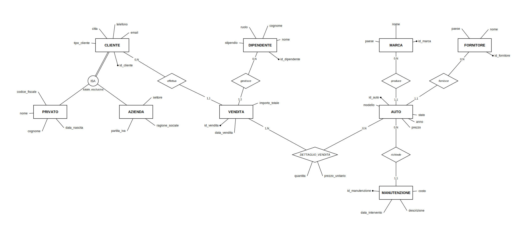
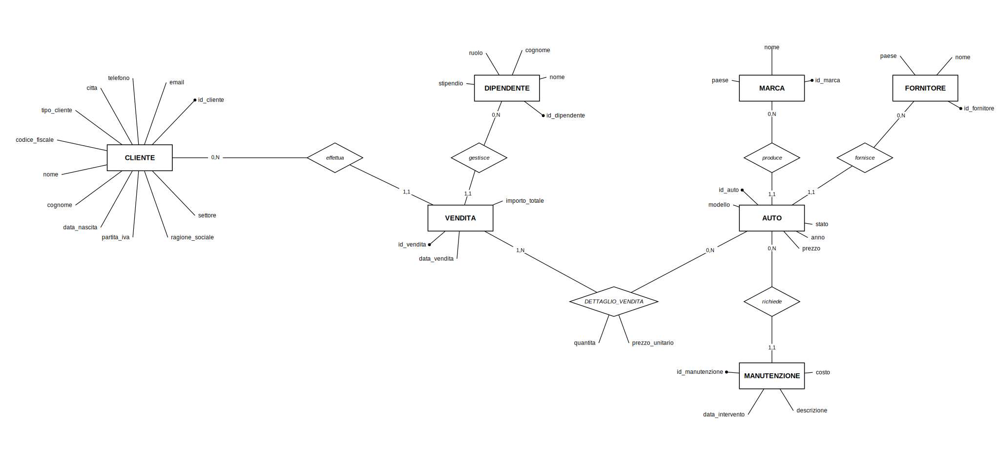
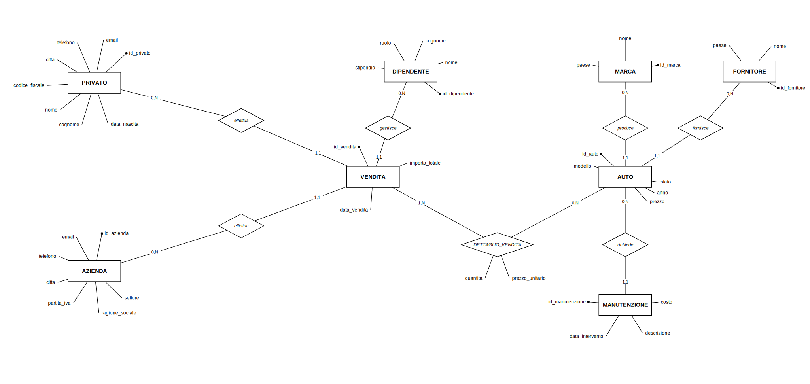
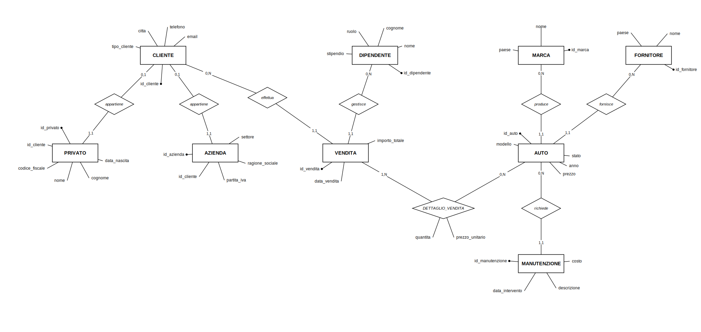

# Documentazione di Progetto

**Sistema Informativo per Concessionaria Auto**

*Nome studente: Antonio Esposito*  
*Corso: Ingegneria e Scienze Informatiche per la Cybersecurity — Università degli Studi di Napoli Parthenope*  

---

## Introduzione

Questo documento descrive il progetto di un sistema informativo per la gestione di una concessionaria automobilistica, sviluppato come progetto d'esame. Il sistema permette di gestire il catalogo dei veicoli, l'anagrafica dei clienti (privati e aziende), le vendite e gli interventi di manutenzione, attraverso un'applicazione web realizzata in Django.

Il documento è organizzato in cinque parti: la progettazione concettuale del database (modello Entità-Relazione), la sua traduzione in uno schema relazionale (modello logico), l'implementazione dell'applicazione web, le istruzioni per installarla e avviarla, ed eventuali approfondimenti sulla sicurezza.

---

## Indice

1. Analisi e progettazione concettuale
   - 1.1 Descrizione del dominio
   - 1.2 Entità e attributi
   - 1.3 Relazioni
   - 1.4 Generalizzazione e specializzazione
   - 1.5 Strategie di traduzione della generalizzazione
     - Scenario 1 — Accorpamento verso il padre (una sola tabella)
     - Scenario 2 — Accorpamento verso i figli (due tabelle)
     - Scenario 3 — Tre tabelle: padre e figli (soluzione adottata)
   - 1.6 Semplificazioni e adattamenti
   - 1.7 Vincoli principali
   - 1.8 Vincoli interrelazionali
2. Progettazione logica
   - 2.1 Regole di derivazione
   - 2.2 Elenco delle entità e degli attributi
   - 2.3 Script di creazione delle tabelle
   - 2.4 Trigger
3. Implementazione del sistema informativo
4. Istruzioni per installazione e avvio

---

## 1. Analisi e progettazione concettuale

### 1.1 Descrizione del dominio

Il sistema informativo gestisce una concessionaria automobilistica che vende veicoli a clienti privati e aziendali, si approvvigiona da fornitori, organizza il lavoro del personale di vendita e tiene traccia degli interventi di manutenzione sul parco auto. Il database costituisce il cuore del sistema e raccoglie tutte le informazioni necessarie a gestire il catalogo dei veicoli, l'anagrafica dei clienti, le transazioni di vendita e l'attività di manutenzione.

### 1.2 Entità e attributi

L'entità **Cliente** rappresenta chiunque acquisti uno o più veicoli dalla concessionaria. È identificata da `id_cliente` e possiede gli attributi comuni a tutti i clienti: email, telefono e città. Poiché un cliente privato e un cliente aziendale necessitano di informazioni molto diverse tra loro, Cliente è generalizzazione di due specializzazioni, descritte nel paragrafo 1.4.

L'entità **Auto** rappresenta ciascun veicolo del parco auto della concessionaria. È identificata da `id_auto` e ha modello, prezzo (vincolato a essere positivo), anno e uno stato che indica se è disponibile, venduta o in manutenzione. Ogni auto appartiene a una marca ed è fornita da un fornitore.

L'entità **Marca** rappresenta il produttore del veicolo (per esempio Fiat, BMW). È identificata da `id_marca`, con nome e paese di origine.

L'entità **Fornitore** rappresenta l'azienda da cui la concessionaria acquista le auto. È identificata da `id_fornitore`, con nome e paese.

L'entità **Vendita** rappresenta una transazione effettuata da un cliente e gestita da un dipendente. È identificata da `id_vendita`, con data della vendita e importo totale.

L'entità **Dettaglio_Vendita** è un'entità associativa che risolve la relazione molti-a-molti tra Vendita e Auto, poiché una vendita può comprendere più auto e, in linea di principio, la stessa auto può comparire in più transazioni. Ha chiave primaria composta (`id_vendita`, `id_auto`) e attributi quantità e prezzo unitario.

L'entità **Dipendente** rappresenta il personale che gestisce le vendite, con nome, cognome, ruolo e stipendio.

L'entità **Manutenzione** rappresenta un intervento effettuato su un'auto, con data, descrizione e costo.

### 1.3 Relazioni

| Relazione | Entità A | (min,max) A | (min,max) B | Entità B | Descrizione |
|---|---|---|---|---|---|
| produce | MARCA | (0,N) | (1,1) | AUTO | Una marca può produrre zero o più auto; ogni auto è prodotta da esattamente una marca |
| fornisce | FORNITORE | (0,N) | (1,1) | AUTO | Un fornitore può fornire zero o più auto; ogni auto proviene da esattamente un fornitore |
| richiede | AUTO | (0,N) | (1,1) | MANUTENZIONE | Un'auto può avere zero o più interventi di manutenzione; ogni manutenzione riguarda esattamente un'auto |
| effettua | CLIENTE | (0,N) | (1,1) | VENDITA | Un cliente può effettuare zero o più vendite; ogni vendita è effettuata da esattamente un cliente |
| gestisce | DIPENDENTE | (0,N) | (1,1) | VENDITA | Un dipendente può gestire zero o più vendite; ogni vendita è gestita da esattamente un dipendente |
| DETTAGLIO_VENDITA | AUTO | (0,N) | (1,N) | VENDITA | Un'auto può comparire in zero o più vendite; ogni vendita contiene almeno un'auto (relazione N:M con attributi: quantità, prezzo_unitario) |

### 1.4 Generalizzazione e specializzazione

Osservando il dominio da due prospettive complementari emerge la necessità di generalizzare/specializzare l'entità Cliente.

Dal basso (approccio bottom-up): **Privato** e **Azienda** emergono come due tipi di cliente con attributi distintivi (un privato è identificato da un codice fiscale, un'azienda da una partita IVA) ma condividono un nucleo di attributi comuni — email, telefono, città — che giustifica l'introduzione dell'entità generalizzata Cliente.

Dall'alto (approccio top-down): partendo dall'entità Cliente, si riconosce la necessità di specializzarla perché non tutti i clienti condividono gli stessi attributi specifici: un cliente privato necessita di nome, cognome, codice fiscale e data di nascita, mentre un'azienda necessita di ragione sociale, partita IVA e settore di attività.

La specializzazione è **totale**, poiché ogni cliente registrato nel sistema deve obbligatoriamente essere o un privato o un'azienda — non esistono clienti "generici" privi di una delle due caratterizzazioni. È inoltre **esclusiva**, poiché un singolo cliente non può appartenere a entrambe le categorie contemporaneamente. Totalità ed esclusività, insieme, definiscono una **partizione completa** dell'entità Cliente nelle due sottoclassi Privato e Azienda.



Il diagramma sopra rappresenta il modello concettuale con il simbolo ISA: Cliente si specializza in Privato e Azienda, con partizione totale ed esclusiva. Questo è il punto di partenza teorico; le tre sottosezioni seguenti mostrano invece le diverse strategie con cui questa generalizzazione può essere *tradotta* in tabelle relazionali.

### 1.5 Strategie di traduzione della generalizzazione

---

#### Scenario 1 — Accorpamento verso il padre (una sola tabella)

La generalizzazione non viene risolta: si crea un'unica tabella `cliente` che raccoglie tutti gli attributi sia della classe padre che delle due sottoclassi.



Problemi di questo approccio:

- **Valori NULL obbligatori**: ogni riga avrà sempre metà degli attributi vuoti. Un cliente privato avrà `partita_iva`, `ragione_sociale` e `settore` sempre NULL; un'azienda avrà `codice_fiscale`, `nome`, `cognome` e `data_nascita` sempre NULL.
- **Nessuna integrità strutturale**: il database non può imporre che un privato abbia sempre `codice_fiscale`, né che un'azienda abbia sempre `partita_iva`. Questi vincoli devono essere gestiti a livello applicativo.

---

#### Scenario 2 — Accorpamento verso i figli (due tabelle)

Gli attributi della classe padre vengono copiati in ciascuna sottoclasse: si creano solo le tabelle `privato` e `azienda`, senza una tabella `cliente` comune.



Problemi di questo approccio:

- **Attributi duplicati**: `email`, `telefono` e `citta` devono essere ripetuti in entrambe le tabelle, violando il principio di non ridondanza.
- **Ricerca su cliente generico impossibile**: per trovare un cliente per email occorre interrogare entrambe le tabelle con una UNION.

---

#### Scenario 3 — Tre tabelle: padre e figli (soluzione adottata)

Si mantengono tre tabelle distinte — `cliente`, `privato` e `azienda`. `cliente` contiene gli attributi comuni; `privato` e `azienda` contengono solo gli attributi specifici e sono collegate a `cliente` tramite una relazione 1:1.



Vantaggi di questo approccio:

- **Nessun valore NULL strutturale**: ogni colonna contiene dati reali per il tipo a cui appartiene.
- **Nessuna ridondanza**: gli attributi comuni sono scritti una sola volta in `cliente`.

### 1.6 Semplificazioni e adattamenti

Lo standard SQL non permette di imporre nativamente, con un semplice vincolo dichiarativo, che ogni riga di `cliente` abbia esattamente una riga corrispondente in `privato` oppure in `azienda`: il vincolo di totalità ed esclusività della partizione richiederebbe un trigger che verifichi l'esistenza incrociata fra tabelle ogni volta che viene inserito un cliente. Per restare entro i limiti di un progetto didattico, è stato introdotto in `cliente` un attributo discriminante `tipo_cliente`, vincolato tramite CHECK ai valori `privato` e `azienda`, demandando all'applicazione Django la responsabilità di creare sempre la riga di specializzazione corretta al momento della registrazione di un nuovo cliente. È una scelta pragmatica, dichiarata esplicitamente come semplificazione rispetto al modello concettuale puro.

### 1.7 Vincoli principali

| Tabella | Vincolo |
|---|---|
| cliente | `email` UNIQUE NOT NULL; `tipo_cliente` CHECK IN (privato, azienda) |
| privato | `id_privato` PK; `id_cliente` FK UNIQUE NOT NULL verso cliente; `codice_fiscale` UNIQUE NOT NULL |
| azienda | `id_azienda` PK; `id_cliente` FK UNIQUE NOT NULL verso cliente; `partita_iva` UNIQUE NOT NULL |
| auto | `prezzo` CHECK (> 0); `stato` CHECK IN (disponibile, venduta, manutenzione); `id_marca`/`id_fornitore` FK NOT NULL |
| vendita | `id_cliente`/`id_dipendente` FK NOT NULL |
| dettaglio_vendita | PK composta (id_vendita, id_auto); `quantita`/`prezzo_unitario` CHECK (> 0) |
| manutenzione | `id_auto` FK NOT NULL |

### 1.8 Vincoli interrelazionali

I vincoli interrelazionali coinvolgono più tabelle contemporaneamente e non possono essere espressi con un semplice CHECK su una singola colonna. Richiederebbero trigger o logica applicativa per essere imposti a livello di database.

| Vincolo | Tabelle coinvolte | Descrizione |
|---|---|---|
| Specializzazione totale ed esclusiva | CLIENTE, PRIVATO, AZIENDA | Ogni riga di CLIENTE deve avere esattamente una riga corrispondente in PRIVATO oppure in AZIENDA, mai in entrambe e mai in nessuna delle due |
| Coerenza stato auto | AUTO, DETTAGLIO_VENDITA | Un'auto con stato "venduta" deve avere almeno una riga in DETTAGLIO_VENDITA; un'auto non può risultare venduta se non compare in nessuna vendita |
| Coerenza importo vendita | VENDITA, DETTAGLIO_VENDITA | Il campo `importo_totale` in VENDITA deve essere uguale alla somma di `quantita * prezzo_unitario` di tutte le righe di DETTAGLIO_VENDITA associate a quella vendita |
| Coerenza stato manutenzione | AUTO, MANUTENZIONE | Un'auto con stato "manutenzione" deve avere almeno una riga in MANUTENZIONE; un'auto non può essere marcata in manutenzione senza un intervento registrato |

---

## 2. Progettazione logica

### 2.1 Regole di derivazione

Il modello logico relazionale è stato derivato dal modello E-R applicando le regole standard: ogni entità diventa una tabella, i suoi attributi diventano colonne e il suo identificatore diventa chiave primaria; ogni relazione 1:N si traduce in una chiave esterna inserita nella tabella dal lato N (per esempio Vendita riceve `id_cliente` e `id_dipendente`); la relazione N:M tra Vendita e Auto, già risolta a livello concettuale dall'entità associativa Dettaglio_Vendita, diventa a livello logico una tabella con chiave primaria composta dalle due chiavi esterne coinvolte.

### 2.2 Elenco delle entità e degli attributi

Di seguito lo schema sintetico di ogni tabella, nella notazione `TABELLA( attributo PK, attributo, attributo FK )`:

**AUTO**
```
AUTO(
  id_auto PK,
  modello,
  prezzo,
  anno,
  stato,
  id_marca FK,
  id_fornitore FK
)
```

**MARCA**
```
MARCA(
  id_marca PK,
  nome,
  paese
)
```

**FORNITORE**
```
FORNITORE(
  id_fornitore PK,
  nome,
  paese
)
```

**CLIENTE**
```
CLIENTE(
  id_cliente PK,
  email,
  telefono,
  citta,
  tipo_cliente
)
```

**PRIVATO**
```
PRIVATO(
  id_privato PK,
  id_cliente FK,
  codice_fiscale,
  nome,
  cognome,
  data_nascita
)
```

**AZIENDA**
```
AZIENDA(
  id_azienda PK,
  id_cliente FK,
  partita_iva,
  ragione_sociale,
  settore
)
```

**DIPENDENTE**
```
DIPENDENTE(
  id_dipendente PK,
  nome,
  cognome,
  ruolo,
  stipendio
)
```

**VENDITA**
```
VENDITA(
  id_vendita PK,
  data_vendita,
  importo_totale,
  id_cliente FK,
  id_dipendente FK
)
```

**DETTAGLIO_VENDITA**
```
DETTAGLIO_VENDITA(
  id_vendita PK/FK,
  id_auto PK/FK,
  quantita,
  prezzo_unitario
)
```

**MANUTENZIONE**
```
MANUTENZIONE(
  id_manutenzione PK,
  data_intervento,
  descrizione,
  costo,
  id_auto FK
)
```

*Nota: in `DETTAGLIO_VENDITA`, l'indicazione "PK/FK" significa che l'attributo è contemporaneamente chiave primaria della tabella e chiave esterna verso un'altra tabella. In `PRIVATO` e `AZIENDA` invece ogni tabella ha una propria chiave primaria autonoma (`id_privato`, `id_azienda`) e una chiave esterna `id_cliente` con vincolo UNIQUE verso `CLIENTE`, realizzando così la relazione 1:1 di specializzazione.*

### 2.3 Script di creazione delle tabelle

```sql
CREATE DATABASE concessionaria_auto;
USE concessionaria_auto;

CREATE TABLE marca (
  id_marca INT PRIMARY KEY AUTO_INCREMENT,
  nome VARCHAR(50) NOT NULL,
  paese VARCHAR(50)
);

CREATE TABLE fornitore (
  id_fornitore INT PRIMARY KEY AUTO_INCREMENT,
  nome VARCHAR(50) NOT NULL,
  paese VARCHAR(50)
);

CREATE TABLE auto (
  id_auto INT PRIMARY KEY AUTO_INCREMENT,
  modello VARCHAR(50) NOT NULL,
  prezzo DECIMAL(10,2) NOT NULL CHECK (prezzo > 0),
  anno INT,
  stato VARCHAR(20) NOT NULL DEFAULT 'disponibile'
    CHECK (stato IN ('disponibile', 'venduta', 'manutenzione')),
  id_marca INT NOT NULL,
  id_fornitore INT NOT NULL,
  FOREIGN KEY (id_marca) REFERENCES marca(id_marca),
  FOREIGN KEY (id_fornitore) REFERENCES fornitore(id_fornitore)
);

-- Generalizzazione Cliente -> Privato / Azienda (strategia "tabella per ogni entita")
CREATE TABLE cliente (
  id_cliente INT PRIMARY KEY AUTO_INCREMENT,
  email VARCHAR(100) UNIQUE NOT NULL,
  telefono VARCHAR(20),
  citta VARCHAR(50),
  tipo_cliente VARCHAR(10) NOT NULL CHECK (tipo_cliente IN ('privato', 'azienda'))
);

CREATE TABLE privato (
  id_privato INT PRIMARY KEY AUTO_INCREMENT,
  id_cliente INT UNIQUE NOT NULL,
  codice_fiscale VARCHAR(16) UNIQUE NOT NULL,
  nome VARCHAR(50) NOT NULL,
  cognome VARCHAR(50) NOT NULL,
  data_nascita DATE,
  FOREIGN KEY (id_cliente) REFERENCES cliente(id_cliente)
);

CREATE TABLE azienda (
  id_azienda INT PRIMARY KEY AUTO_INCREMENT,
  id_cliente INT UNIQUE NOT NULL,
  partita_iva VARCHAR(11) UNIQUE NOT NULL,
  ragione_sociale VARCHAR(100) NOT NULL,
  settore VARCHAR(50),
  FOREIGN KEY (id_cliente) REFERENCES cliente(id_cliente)
);

CREATE TABLE dipendente (
  id_dipendente INT PRIMARY KEY AUTO_INCREMENT,
  nome VARCHAR(50) NOT NULL,
  cognome VARCHAR(50) NOT NULL,
  ruolo VARCHAR(50),
  stipendio DECIMAL(10,2)
);

CREATE TABLE vendita (
  id_vendita INT PRIMARY KEY AUTO_INCREMENT,
  data_vendita DATE NOT NULL,
  importo_totale DECIMAL(10,2) DEFAULT 0,
  id_cliente INT NOT NULL,
  id_dipendente INT NOT NULL,
  FOREIGN KEY (id_cliente) REFERENCES cliente(id_cliente),
  FOREIGN KEY (id_dipendente) REFERENCES dipendente(id_dipendente)
);

-- Tabella ponte per la relazione N:M Vendita <-> Auto
CREATE TABLE dettaglio_vendita (
  id_vendita INT,
  id_auto INT,
  quantita INT NOT NULL CHECK (quantita > 0),
  prezzo_unitario DECIMAL(10,2) NOT NULL CHECK (prezzo_unitario > 0),
  PRIMARY KEY (id_vendita, id_auto),
  FOREIGN KEY (id_vendita) REFERENCES vendita(id_vendita),
  FOREIGN KEY (id_auto) REFERENCES auto(id_auto)
);

CREATE TABLE manutenzione (
  id_manutenzione INT PRIMARY KEY AUTO_INCREMENT,
  data_intervento DATE,
  descrizione VARCHAR(100),
  costo DECIMAL(10,2),
  id_auto INT NOT NULL,
  FOREIGN KEY (id_auto) REFERENCES auto(id_auto)
);
```

### 2.4 Trigger

I trigger seguenti sono effettivamente implementati a livello di database, tramite la migration Django `gestionale/migrations/0003_triggers.py` (che usa `migrations.RunSQL` per creare i trigger direttamente in SQLite), in aggiunta alla logica applicativa gestita dai modelli. La sintassi mostrata di seguito è espressa in stile SQL standard per chiarezza espositiva; l'implementazione reale in SQLite usa una sintassi leggermente diversa (clausola `WHEN` e `RAISE(ABORT, ...)` al posto di `SIGNAL SQLSTATE`), visibile direttamente nel file di migration.

**Trigger 1 — Aggiorna lo stato dell'auto a "venduta" dopo una vendita**

```sql
CREATE TRIGGER aggiorna_stato_auto
AFTER INSERT ON dettaglio_vendita
FOR EACH ROW
BEGIN
    UPDATE auto
    SET stato = 'venduta'
    WHERE id_auto = NEW.id_auto;
END;
```

Ogni volta che un'auto viene inserita in `dettaglio_vendita` (cioè entra in una vendita), il suo stato viene automaticamente aggiornato a `venduta`. Si tratta di un trigger che mantiene la coerenza dei dati tra due tabelle correlate.

**Trigger 2 — Vincolo interrelazionale sulla specializzazione Cliente**

```sql
CREATE TRIGGER controlla_specializzazione
AFTER INSERT ON cliente
FOR EACH ROW
BEGIN
    IF NEW.tipo_cliente NOT IN ('privato', 'azienda') THEN
        SIGNAL SQLSTATE '45000'
        SET MESSAGE_TEXT = 'tipo_cliente deve essere privato o azienda';
    END IF;
END;
```

Dopo ogni inserimento in `cliente`, verifica che il campo `tipo_cliente` sia valido. Questo trigger implementa il vincolo interrelazionale di totalità ed esclusività della specializzazione descritto nella sezione 1.8: ogni cliente deve appartenere esattamente a una delle due sottoclassi.

**Trigger 3 — Aggiorna l'importo totale della vendita dopo ogni dettaglio**

```sql
CREATE TRIGGER aggiorna_importo_vendita
AFTER INSERT ON dettaglio_vendita
FOR EACH ROW
BEGIN
    UPDATE vendita
    SET importo_totale = (
        SELECT SUM(quantita * prezzo_unitario)
        FROM dettaglio_vendita
        WHERE id_vendita = NEW.id_vendita
    )
    WHERE id_vendita = NEW.id_vendita;
END;
```

Ogni volta che viene inserita una riga in `dettaglio_vendita`, il trigger ricalcola la somma di `quantita * prezzo_unitario` per tutti i dettagli associati a quella vendita e aggiorna di conseguenza il campo `importo_totale` nella tabella `vendita`. Questo trigger implementa il vincolo interrelazionale di coerenza importo descritto nella sezione 1.10: il totale della vendita deve sempre corrispondere alla somma dei suoi dettagli, senza affidarsi alla logica applicativa.

---

## 3. Implementazione del sistema informativo

### 3.3 Funzionalità implementate

Il sistema è sviluppato con **Django 6.0** e **Bootstrap 5** (CSS via CDN, nessun JavaScript custom). Il database è SQLite. Sono state implementate tre funzionalità principali:

- **Home page** — la pagina `/` mostra il numero totale di auto attualmente disponibili nel catalogo, interrogando il database in tempo reale.
- **Catalogo auto** — la pagina `/auto/` elenca tutte le auto con stato "disponibile", mostrando per ciascuna marca e modello.
- **Dettaglio auto** — la pagina `/auto/<id>/` mostra la scheda completa di un singolo veicolo: modello, marca, fornitore, prezzo, anno e stato. Se l'ID non esiste viene restituito automaticamente un errore HTTP 404.

---

## 4. Istruzioni per installazione e avvio

### Requisiti

- Python 3.12 o superiore (testato con Python 3.14)
- Git

### Installazione

```bash
# 1. Clona il repository
git clone <URL-repository>
cd progetto_concessionaria_parziale

# 2. Crea e attiva il virtual environment
python -m venv venv

# Windows
venv\Scripts\activate
# macOS/Linux
source venv/bin/activate

# 3. Installa le dipendenze
pip install -r requirements.txt

# 4. Avvia il server di sviluppo
python manage.py runserver
```

> **Nota**: il file `db.sqlite3` è incluso nel repository e contiene già i dati di esempio. Non è necessario eseguire migrazioni né caricare dati separatamente.

### Accesso

Dopo l'avvio, il sistema è raggiungibile all'indirizzo: **http://127.0.0.1:8000/**

| URL | Descrizione |
|---|---|
| `/` | Home page con contatore auto disponibili |
| `/auto/` | Catalogo veicoli disponibili |
| `/auto/<id>/` | Scheda dettaglio veicolo |
| `/admin/` | Area amministrativa Django |

### Credenziali area amministrativa

Per accedere al pannello `/admin/` usare le credenziali dell'account amministratore creato in fase di setup con `python manage.py createsuperuser`.

