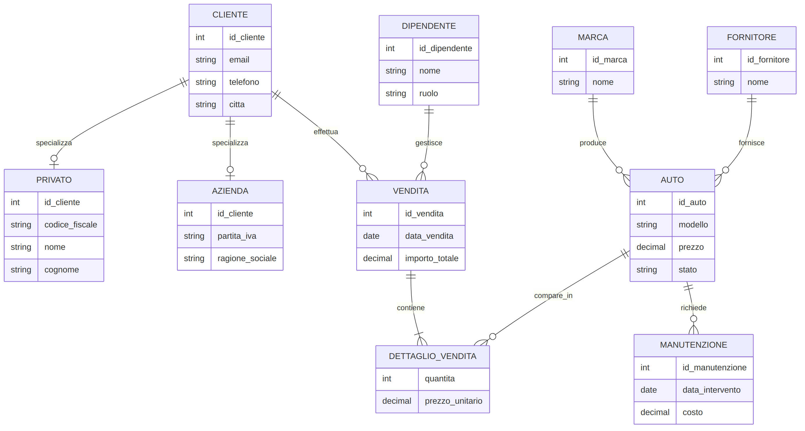

# Documentazione di Progetto

**Sistema Informativo per Concessionaria Auto**

*Nome studente: Antonio Esposito*
*Corso: Ingegneria e Scienze Informatiche per la Cybersecurity — Università degli Studi di Napoli Parthenope*
*Data: 30/06/2026*

---

## Introduzione

Questo documento descrive il progetto di un sistema informativo per la gestione di una concessionaria automobilistica, sviluppato come progetto d'esame. Il sistema permette di gestire il catalogo dei veicoli, l'anagrafica dei clienti (privati e aziende), le vendite e gli interventi di manutenzione, attraverso un'applicazione web realizzata in Django.

Il documento è organizzato in cinque parti: la progettazione concettuale del database (modello Entità-Relazione), la sua traduzione in uno schema relazionale (modello logico), l'implementazione dell'applicazione web, le istruzioni per installarla e avviarla, ed eventuali approfondimenti sulla sicurezza.

---

## Indice

1. Analisi e progettazione concettuale
2. Progettazione logica
3. Implementazione del sistema informativo
4. Istruzioni per installazione e avvio
5. Bonus (sicurezza)

---

## 1. Analisi e progettazione concettuale

### 1.1 Descrizione del dominio

Il sistema informativo gestisce una concessionaria automobilistica che vende veicoli a clienti privati e aziendali, si approvvigiona da fornitori, organizza il lavoro del personale di vendita e tiene traccia degli interventi di manutenzione sul parco auto. Il database costituisce il cuore del sistema e raccoglie tutte le informazioni necessarie a gestire il catalogo dei veicoli, l'anagrafica dei clienti, le transazioni di vendita e l'attività di manutenzione.

### 1.2 Entità e attributi

L'entità **Cliente** rappresenta chiunque acquisti uno o più veicoli dalla concessionaria. È identificata da `id_cliente` e possiede gli attributi comuni a tutti i clienti: email, telefono e città. Poiché un cliente privato e un cliente aziendale necessitano di informazioni molto diverse tra loro, Cliente è generalizzazione di due specializzazioni, descritte nel paragrafo 1.4.

L'entità **Auto** rappresenta ciascun veicolo del parco auto della concessionaria. È identificata da `id_auto` e ha modello, prezzo (vincolato a essere positivo), anno e uno stato che indica se è disponibile, venduta o in manutenzione. Ogni auto appartiene a una marca ed è fornita da un fornitore.

L'entità **Marca** rappresenta il produttore del veicolo (per esempio Fiat, BMW). È identificata da `id_marca`, con nome e paese di origine.

L'entità **Fornitore** rappresenta l'azienda da cui la concessionaria acquista le auto. È identificata da `id_fornitore`, con nome e paese.

L'entità **Vendita** rappresenta una transazione effettuata da un cliente e gestita da un dipendente. È identificata da `id_vendita`, con data della vendita e importo totale.

L'entità **Dettaglio_Vendita** è un'entità associativa che risolve la relazione molti-a-molti tra Vendita e Auto, poiché una vendita può comprendere più auto e, in linea di principio, la stessa auto può comparire in più transazioni. Ha chiave primaria composta (`id_vendita`, `id_auto`) e attributi quantità e prezzo unitario.

L'entità **Dipendente** rappresenta il personale che gestisce le vendite, con nome, cognome, ruolo e stipendio.

L'entità **Manutenzione** rappresenta un intervento effettuato su un'auto, con data, descrizione e costo.

### 1.3 Relazioni

| Relazione | Cardinalità | Descrizione |
|---|---|---|
| Cliente effettua Vendita | 1:N | Un cliente può effettuare più vendite; ogni vendita appartiene a un solo cliente |
| Dipendente gestisce Vendita | 1:N | Un dipendente può gestire più vendite; ogni vendita è gestita da un solo dipendente |
| Auto appartiene a Marca | N:1 | Più auto possono appartenere alla stessa marca; ogni auto ha una sola marca |
| Auto è fornita da Fornitore | N:1 | Più auto possono provenire dallo stesso fornitore; ogni auto ha un solo fornitore |
| Auto è soggetta a Manutenzione | 1:N | Un'auto può avere più interventi di manutenzione nel tempo |
| Vendita include Auto | N:M | Una vendita può comprendere più auto e un'auto può comparire in più vendite; relazione risolta tramite Dettaglio_Vendita |

### 1.4 Generalizzazione e specializzazione

Osservando il dominio da due prospettive complementari emerge la necessità di generalizzare/specializzare l'entità Cliente.

Dal basso (approccio bottom-up): **Privato** e **Azienda** emergono come due tipi di cliente con attributi distintivi (un privato è identificato da un codice fiscale, un'azienda da una partita IVA) ma condividono un nucleo di attributi comuni — email, telefono, città — che giustifica l'introduzione dell'entità generalizzata Cliente.

Dall'alto (approccio top-down): partendo dall'entità Cliente, si riconosce la necessità di specializzarla perché non tutti i clienti condividono gli stessi attributi specifici: un cliente privato necessita di nome, cognome, codice fiscale e data di nascita, mentre un'azienda necessita di ragione sociale, partita IVA e settore di attività.

La specializzazione è **totale**, poiché ogni cliente registrato nel sistema deve obbligatoriamente essere o un privato o un'azienda — non esistono clienti "generici" privi di una delle due caratterizzazioni. È inoltre **esclusiva**, poiché un singolo cliente non può appartenere a entrambe le categorie contemporaneamente. Totalità ed esclusività, insieme, definiscono una **partizione completa** dell'entità Cliente nelle due sottoclassi Privato e Azienda.

### 1.5 Diagramma E-R



*Nota: la notazione a "zampa di gallina" utilizzata nel diagramma non può esprimere graficamente il vincolo di totalità della specializzazione (mostra Privato e Azienda come opzionali rispetto a Cliente). Il vincolo reale — totalità ed esclusività, descritte nel paragrafo 1.4 — va quindi sempre considerato insieme alla spiegazione testuale, non solo dal diagramma.*

---

## 2. Progettazione logica

### 2.1 Regole di derivazione

Il modello logico relazionale è stato derivato dal modello E-R applicando le regole standard: ogni entità diventa una tabella, i suoi attributi diventano colonne e il suo identificatore diventa chiave primaria; ogni relazione 1:N si traduce in una chiave esterna inserita nella tabella dal lato N (per esempio Vendita riceve `id_cliente` e `id_dipendente`); la relazione N:M tra Vendita e Auto, già risolta a livello concettuale dall'entità associativa Dettaglio_Vendita, diventa a livello logico una tabella con chiave primaria composta dalle due chiavi esterne coinvolte.

### 2.2 Derivazione della generalizzazione

Per tradurre la generalizzazione Cliente → Privato/Azienda è stata adottata la strategia "tabella per ogni entità": una tabella `cliente` contiene gli attributi comuni, mentre `privato` e `azienda` hanno come chiave primaria lo stesso `id_cliente`, che è anche chiave esterna verso `cliente` (relazione 1:1 di tipo "is-a"). Questa strategia è preferibile rispetto a un'unica tabella con tutti gli attributi (che produrrebbe molti valori NULL) perché mantiene lo schema normalizzato, al costo di richiedere un JOIN per ricostruire il profilo completo di un cliente.

### 2.3 Semplificazioni e adattamenti

Lo standard SQL non permette di imporre nativamente, con un semplice vincolo dichiarativo, che ogni riga di `cliente` abbia esattamente una riga corrispondente in `privato` oppure in `azienda`: il vincolo di totalità ed esclusività della partizione richiederebbe un trigger che verifichi l'esistenza incrociata fra tabelle ogni volta che viene inserito un cliente. Per restare entro i limiti di un progetto didattico, è stato introdotto in `cliente` un attributo discriminante `tipo_cliente`, vincolato tramite CHECK ai valori `privato` e `azienda`, demandando all'applicazione Django la responsabilità di creare sempre la riga di specializzazione corretta al momento della registrazione di un nuovo cliente. È una scelta pragmatica, dichiarata esplicitamente come semplificazione rispetto al modello concettuale puro.

### 2.4 Vincoli principali

| Tabella | Vincolo |
|---|---|
| cliente | `email` UNIQUE NOT NULL; `tipo_cliente` CHECK IN (privato, azienda) |
| privato | `id_cliente` PK/FK verso cliente; `codice_fiscale` UNIQUE NOT NULL |
| azienda | `id_cliente` PK/FK verso cliente; `partita_iva` UNIQUE NOT NULL |
| auto | `prezzo` CHECK (> 0); `stato` CHECK IN (disponibile, venduta, manutenzione); `id_marca`/`id_fornitore` FK NOT NULL |
| vendita | `id_cliente`/`id_dipendente` FK NOT NULL |
| dettaglio_vendita | PK composta (id_vendita, id_auto); `quantita`/`prezzo_unitario` CHECK (> 0) |
| manutenzione | `id_auto` FK NOT NULL |

### 2.5 Script di creazione delle tabelle

```sql
CREATE DATABASE concessionaria_auto;
USE concessionaria_auto;

CREATE TABLE marca (
  id_marca INT PRIMARY KEY AUTO_INCREMENT,
  nome VARCHAR(50) NOT NULL,
  paese VARCHAR(50)
);

CREATE TABLE fornitore (
  id_fornitore INT PRIMARY KEY AUTO_INCREMENT,
  nome VARCHAR(50) NOT NULL,
  paese VARCHAR(50)
);

CREATE TABLE auto (
  id_auto INT PRIMARY KEY AUTO_INCREMENT,
  modello VARCHAR(50) NOT NULL,
  prezzo DECIMAL(10,2) NOT NULL CHECK (prezzo > 0),
  anno INT,
  stato VARCHAR(20) NOT NULL DEFAULT 'disponibile'
    CHECK (stato IN ('disponibile', 'venduta', 'manutenzione')),
  id_marca INT NOT NULL,
  id_fornitore INT NOT NULL,
  FOREIGN KEY (id_marca) REFERENCES marca(id_marca),
  FOREIGN KEY (id_fornitore) REFERENCES fornitore(id_fornitore)
);

-- Generalizzazione Cliente -> Privato / Azienda (strategia "tabella per ogni entita")
CREATE TABLE cliente (
  id_cliente INT PRIMARY KEY AUTO_INCREMENT,
  email VARCHAR(100) UNIQUE NOT NULL,
  telefono VARCHAR(20),
  citta VARCHAR(50),
  tipo_cliente VARCHAR(10) NOT NULL CHECK (tipo_cliente IN ('privato', 'azienda'))
);

CREATE TABLE privato (
  id_cliente INT PRIMARY KEY,
  codice_fiscale VARCHAR(16) UNIQUE NOT NULL,
  nome VARCHAR(50) NOT NULL,
  cognome VARCHAR(50) NOT NULL,
  data_nascita DATE,
  FOREIGN KEY (id_cliente) REFERENCES cliente(id_cliente)
);

CREATE TABLE azienda (
  id_cliente INT PRIMARY KEY,
  partita_iva VARCHAR(11) UNIQUE NOT NULL,
  ragione_sociale VARCHAR(100) NOT NULL,
  settore VARCHAR(50),
  FOREIGN KEY (id_cliente) REFERENCES cliente(id_cliente)
);

CREATE TABLE dipendente (
  id_dipendente INT PRIMARY KEY AUTO_INCREMENT,
  nome VARCHAR(50) NOT NULL,
  cognome VARCHAR(50) NOT NULL,
  ruolo VARCHAR(50),
  stipendio DECIMAL(10,2)
);

CREATE TABLE vendita (
  id_vendita INT PRIMARY KEY AUTO_INCREMENT,
  data_vendita DATE NOT NULL,
  importo_totale DECIMAL(10,2) DEFAULT 0,
  id_cliente INT NOT NULL,
  id_dipendente INT NOT NULL,
  FOREIGN KEY (id_cliente) REFERENCES cliente(id_cliente),
  FOREIGN KEY (id_dipendente) REFERENCES dipendente(id_dipendente)
);

-- Tabella ponte per la relazione N:M Vendita <-> Auto
CREATE TABLE dettaglio_vendita (
  id_vendita INT,
  id_auto INT,
  quantita INT NOT NULL CHECK (quantita > 0),
  prezzo_unitario DECIMAL(10,2) NOT NULL CHECK (prezzo_unitario > 0),
  PRIMARY KEY (id_vendita, id_auto),
  FOREIGN KEY (id_vendita) REFERENCES vendita(id_vendita),
  FOREIGN KEY (id_auto) REFERENCES auto(id_auto)
);

CREATE TABLE manutenzione (
  id_manutenzione INT PRIMARY KEY AUTO_INCREMENT,
  data_intervento DATE,
  descrizione VARCHAR(100),
  costo DECIMAL(10,2),
  id_auto INT NOT NULL,
  FOREIGN KEY (id_auto) REFERENCES auto(id_auto)
);
```

---

## 3. Implementazione del sistema informativo

### 3.1 Stack tecnologico

Il sistema è implementato con **Django 6.0** (backend e template engine) e **Bootstrap 5** (CSS via CDN). Non viene usato JavaScript custom: l'unico JS presente è il bundle di Bootstrap, necessario per il menu responsive su mobile. Il database è SQLite, scelto per semplicità di installazione e portabilità del progetto didattico.

### 3.2 Struttura del progetto

```
progetto_concessionaria_parziale/   ← root del repository (clonare qui)
├── .gitignore
├── requirements.txt
├── manage.py                       ← punto di ingresso Django
├── dati_esempio.json               ← dump con dati di esempio
├── venv/                           ← virtual environment (escluso da git)
├── concessionaria_project/         ← configurazione Django
│   ├── settings.py
│   └── urls.py
├── gestionale/                     ← unica app Django
│   ├── models.py
│   ├── views.py
│   ├── forms.py
│   ├── urls.py
│   ├── admin.py
│   ├── management/commands/popola_db.py
│   ├── migrations/
│   └── templates/
│       ├── gestionale/             ← template dell'app
│       └── registration/           ← override template login Django
└── documentazione/
    ├── Documentazione.md
    ├── schema_logico.sql
    └── immagini/er_completo.png
```

### 3.3 Funzionalità implementate

**Funzionalità 1 — Registrazione e login**

La registrazione distingue due percorsi separati: `/registrazione/privato/` per i clienti privati (richiede nome, cognome, codice fiscale) e `/registrazione/azienda/` per le aziende (richiede ragione sociale, partita IVA). Entrambi i form estendono `UserCreationForm` di Django e, al salvataggio, creano atomicamente tre oggetti: `User` (autenticazione), `Cliente` (dati comuni), `Privato` o `Azienda` (dati specifici della specializzazione). Il login usa direttamente la view built-in di Django (`django.contrib.auth.urls`), con template personalizzato. Il logout avviene tramite POST, come richiesto da Django 5+.

**Funzionalità 2 — Ricerca auto**

La pagina `/auto/` mostra tutte le auto disponibili e permette di filtrarle per marca (ricerca testuale parziale, case-insensitive), modello, prezzo minimo e prezzo massimo. I filtri sono combinabili. Ogni risultato ha un link alla scheda di dettaglio (`/auto/<id>/`) che mostra tutti gli attributi del veicolo, il fornitore, lo stato e un collegamento diretto allo storico manutenzioni.

**Funzionalità 3 — Storico vendite del cliente loggato**

La pagina `/le-mie-vendite/` è protetta con `@login_required`: se l'utente non è autenticato viene rediretto al login. Mostra tutte le vendite associate al cliente corrente, con il dettaglio di ogni auto acquistata, quantità, prezzo unitario, subtotale e totale della transazione.

**Funzionalità 4 — Storico manutenzioni di un'auto**

La pagina `/manutenzioni/` presenta un menu a tendina con tutte le auto del parco. Selezionando un veicolo e confermando con un GET, la pagina mostra la tabella degli interventi di manutenzione registrati per quell'auto (data, descrizione, costo). Il link "Storico manutenzioni" nella scheda dettaglio auto precompila automaticamente la selezione.

### 3.4 Scelte implementative notevoli

- **Generalizzazione nel codice**: la view di registrazione crea sempre sia il record `Cliente` sia il record `Privato`/`Azienda` nella stessa transazione, garantendo il vincolo di totalità descritto nella sezione 2.3.
- **Protezione CSRF**: tutti i form POST usano ``. Il logout è implementato come form POST (non link GET) per rispettare la protezione CSRF e il requisito di Django 6.
- **ORM e query efficienti**: le view usano `select_related` e `prefetch_related` per evitare il problema N+1 nelle pagine che attraversano relazioni (es. storico vendite con dettagli e auto).
- **Validazione**: i form verificano unicità di email, codice fiscale e partita IVA prima del salvataggio, restituendo errori inline nel form.

---

## 4. Istruzioni per installazione e avvio

### Requisiti

- Python 3.12 o superiore (testato con Python 3.14)
- Git

### Installazione

```bash
# 1. Clona il repository
git clone <URL-repository>
cd progetto_concessionaria_parziale

# 2. Crea e attiva il virtual environment
python -m venv venv

# Windows
venv\Scripts\activate
# macOS/Linux
source venv/bin/activate

# 3. Installa le dipendenze
pip install -r requirements.txt

# 4. Esegui le migrazioni
python manage.py migrate

# 5. Carica i dati di esempio
python manage.py loaddata dati_esempio.json

# 6. Avvia il server di sviluppo
python manage.py runserver
```

> **Nota per lo sviluppo**: `python manage.py popola_db` è un comando alternativo
> che rigenera i dati di esempio da zero (utile se si vuole ripartire da un
> database vuoto senza usare il dump).

### Accesso

Dopo l'avvio, il sistema è raggiungibile all'indirizzo: **http://127.0.0.1:8000/**

| URL | Descrizione |
|---|---|
| `/` | Home page |
| `/auto/` | Catalogo e ricerca veicoli |
| `/auto/<id>/` | Scheda dettaglio veicolo |
| `/manutenzioni/` | Storico manutenzioni |
| `/le-mie-vendite/` | Storico acquisti (richiede login) |
| `/registrazione/` | Scelta tipo di registrazione |
| `/accounts/login/` | Login |
| `/admin/` | Area amministrativa Django |

### Credenziali dati di esempio

Dopo `loaddata dati_esempio.json` sono disponibili questi account:

| Username | Password | Tipo |
|---|---|---|
| `admin` | `Admin123!` | Amministratore (area `/admin/`) |
| `mario_rossi` | `Password123!` | Cliente privato |
| `anna_verdi` | `Password123!` | Cliente privato |
| `luca_neri` | `Password123!` | Cliente privato |
| `flotta_srl` | `Password123!` | Azienda |
| `tecno_auto` | `Password123!` | Azienda |

---

## 5. Bonus

In questa versione del progetto non è stata implementata la simulazione di attacco facoltativa prevista dalla traccia (SQL injection, attacco a dizionario o brute-force). Si segnala comunque che l'uso dell'ORM di Django per tutte le query (mai SQL grezzo concatenato con input dell'utente) protegge nativamente dalla SQL injection, e che l'autenticazione tramite `django.contrib.auth` applica già hashing delle password e validazioni minime di robustezza.
