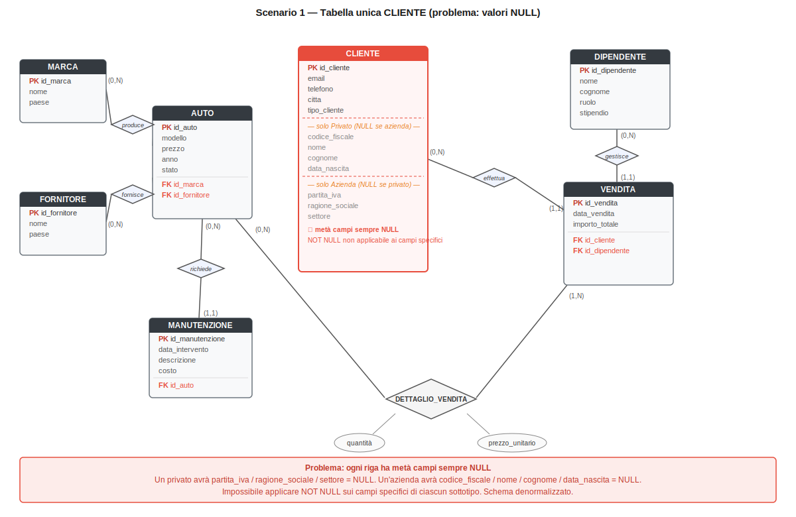
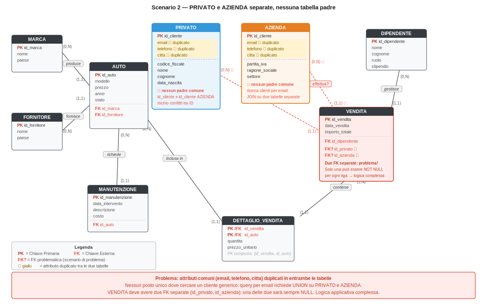
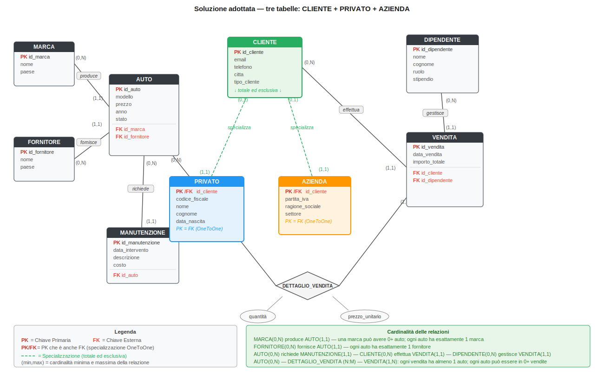

# Documentazione di Progetto

**Sistema Informativo per Concessionaria Auto**

*Nome studente: Antonio Esposito*  
*Corso: Ingegneria e Scienze Informatiche per la Cybersecurity — Università degli Studi di Napoli Parthenope*  
*Data: 30/06/2026*

---

## Introduzione

Questo documento descrive il progetto di un sistema informativo per la gestione di una concessionaria automobilistica, sviluppato come progetto d'esame. Il sistema permette di gestire il catalogo dei veicoli, l'anagrafica dei clienti (privati e aziende), le vendite e gli interventi di manutenzione, attraverso un'applicazione web realizzata in Django.

Il documento è organizzato in cinque parti: la progettazione concettuale del database (modello Entità-Relazione), la sua traduzione in uno schema relazionale (modello logico), l'implementazione dell'applicazione web, le istruzioni per installarla e avviarla, ed eventuali approfondimenti sulla sicurezza.

---

## Indice

1. Analisi e progettazione concettuale
   - 1.1 Descrizione del dominio
   - 1.2 Entità e attributi
   - 1.3 Relazioni
   - 1.4 Generalizzazione e specializzazione
   - 1.5 Scenari alternativi scartati e loro problemi
   - 1.6 Soluzione adottata — Diagramma E-R con tre tabelle
   - 1.7 Derivazione della generalizzazione
   - 1.8 Semplificazioni e adattamenti
   - 1.9 Vincoli principali
2. Progettazione logica
   - 2.1 Regole di derivazione
   - 2.2 Elenco delle entità e degli attributi
   - 2.3 Script di creazione delle tabelle
3. Implementazione del sistema informativo
4. Istruzioni per installazione e avvio

---

## 1. Analisi e progettazione concettuale

### 1.1 Descrizione del dominio

Il sistema informativo gestisce una concessionaria automobilistica che vende veicoli a clienti privati e aziendali, si approvvigiona da fornitori, organizza il lavoro del personale di vendita e tiene traccia degli interventi di manutenzione sul parco auto. Il database costituisce il cuore del sistema e raccoglie tutte le informazioni necessarie a gestire il catalogo dei veicoli, l'anagrafica dei clienti, le transazioni di vendita e l'attività di manutenzione.

### 1.2 Entità e attributi

L'entità **Cliente** rappresenta chiunque acquisti uno o più veicoli dalla concessionaria. È identificata da `id_cliente` e possiede gli attributi comuni a tutti i clienti: email, telefono e città. Poiché un cliente privato e un cliente aziendale necessitano di informazioni molto diverse tra loro, Cliente è generalizzazione di due specializzazioni, descritte nel paragrafo 1.4.

L'entità **Auto** rappresenta ciascun veicolo del parco auto della concessionaria. È identificata da `id_auto` e ha modello, prezzo (vincolato a essere positivo), anno e uno stato che indica se è disponibile, venduta o in manutenzione. Ogni auto appartiene a una marca ed è fornita da un fornitore.

L'entità **Marca** rappresenta il produttore del veicolo (per esempio Fiat, BMW). È identificata da `id_marca`, con nome e paese di origine.

L'entità **Fornitore** rappresenta l'azienda da cui la concessionaria acquista le auto. È identificata da `id_fornitore`, con nome e paese.

L'entità **Vendita** rappresenta una transazione effettuata da un cliente e gestita da un dipendente. È identificata da `id_vendita`, con data della vendita e importo totale.

L'entità **Dettaglio_Vendita** è un'entità associativa che risolve la relazione molti-a-molti tra Vendita e Auto, poiché una vendita può comprendere più auto e, in linea di principio, la stessa auto può comparire in più transazioni. Ha chiave primaria composta (`id_vendita`, `id_auto`) e attributi quantità e prezzo unitario.

L'entità **Dipendente** rappresenta il personale che gestisce le vendite, con nome, cognome, ruolo e stipendio.

L'entità **Manutenzione** rappresenta un intervento effettuato su un'auto, con data, descrizione e costo.

### 1.3 Relazioni

| Relazione | Cardinalità | Descrizione |
|---|---|---|
| Cliente effettua Vendita | 1:N | Un cliente può effettuare più vendite; ogni vendita appartiene a un solo cliente |
| Dipendente gestisce Vendita | 1:N | Un dipendente può gestire più vendite; ogni vendita è gestita da un solo dipendente |
| Auto appartiene a Marca | N:1 | Più auto possono appartenere alla stessa marca; ogni auto ha una sola marca |
| Auto è fornita da Fornitore | N:1 | Più auto possono provenire dallo stesso fornitore; ogni auto ha un solo fornitore |
| Auto è soggetta a Manutenzione | 1:N | Un'auto può avere più interventi di manutenzione nel tempo |
| Vendita include Auto | N:M | Una vendita può comprendere più auto e un'auto può comparire in più vendite; relazione risolta tramite Dettaglio_Vendita |

### 1.4 Generalizzazione e specializzazione

Osservando il dominio da due prospettive complementari emerge la necessità di generalizzare/specializzare l'entità Cliente.

Dal basso (approccio bottom-up): **Privato** e **Azienda** emergono come due tipi di cliente con attributi distintivi (un privato è identificato da un codice fiscale, un'azienda da una partita IVA) ma condividono un nucleo di attributi comuni — email, telefono, città — che giustifica l'introduzione dell'entità generalizzata Cliente.

Dall'alto (approccio top-down): partendo dall'entità Cliente, si riconosce la necessità di specializzarla perché non tutti i clienti condividono gli stessi attributi specifici: un cliente privato necessita di nome, cognome, codice fiscale e data di nascita, mentre un'azienda necessita di ragione sociale, partita IVA e settore di attività.

La specializzazione è **totale**, poiché ogni cliente registrato nel sistema deve obbligatoriamente essere o un privato o un'azienda — non esistono clienti "generici" privi di una delle due caratterizzazioni. È inoltre **esclusiva**, poiché un singolo cliente non può appartenere a entrambe le categorie contemporaneamente. Totalità ed esclusività, insieme, definiscono una **partizione completa** dell'entità Cliente nelle due sottoclassi Privato e Azienda.

### 1.5 Scenari alternativi scartati e loro problemi

Per tradurre a livello logico la generalizzazione Cliente → Privato/Azienda esistono tre approcci principali. I primi due sono stati analizzati e scartati perché introducono problemi strutturali; il terzo — descritto nel paragrafo 1.6 — è quello adottato nel progetto.

**Scenario 1 — Tabella unica con tutti gli attributi (scartato)**

Si crea una sola tabella `cliente` che contiene tutti gli attributi sia di Privato che di Azienda. Questo approccio presenta due problemi gravi:

- *Valori NULL strutturali:* ogni riga ha sempre metà dei campi vuoti. Un cliente privato avrà `partita_iva`, `ragione_sociale` e `settore` sempre NULL; un'azienda avrà `codice_fiscale`, `nome`, `cognome` e `data_nascita` sempre NULL. Lo schema è denormalizzato e spreca spazio.
- *Impossibilità di imporre NOT NULL:* non è possibile rendere obbligatori i campi specifici di ciascun sottotipo perché la stessa colonna deve accettare NULL per l'altro sottotipo.

Per questi motivi lo **Scenario 1 è stato scartato**.



**Scenario 2 — Solo le due tabelle figlie, senza tabella padre (scartato)**

Si creano solo `privato` e `azienda`, senza una tabella `cliente` comune. Anche questo approccio presenta problemi gravi:

- *Attributi duplicati:* `email`, `telefono` e `citta` devono essere ripetuti in entrambe le tabelle, violando il principio di non ridondanza.
- *Ricerca impossibile su cliente generico:* per trovare un cliente per email occorre interrogare entrambe le tabelle con una UNION, rendendo le query più complesse e fragili.
- *Doppia chiave esterna in Vendita:* la tabella `vendita` dovrebbe avere due colonne separate — `id_privato` e `id_azienda` — di cui solo una per riga è valorizzata e l'altra è sempre NULL, reintroducendo il problema dei valori NULL strutturali.

Per questi motivi lo **Scenario 2 è stato scartato**.



### 1.6 Soluzione adottata — Diagramma E-R con tre tabelle

Entrambi gli scenari alternativi sono stati scartati. La soluzione adottata è la strategia **"tabella per ogni entità"** (o *table per subclass*): si mantengono tre tabelle distinte — `cliente`, `privato` e `azienda` — che risolvono tutti i problemi identificati:

- *Nessun valore NULL strutturale:* `cliente` contiene solo gli attributi comuni (email, telefono, citta); `privato` contiene solo i campi del cliente privato; `azienda` solo quelli aziendali. Ogni colonna può essere dichiarata NOT NULL dove necessario.
- *Nessuna ridondanza:* gli attributi comuni sono scritti una sola volta nella tabella `cliente`, non duplicati.
- *Un'unica chiave esterna in Vendita:* `vendita` punta sempre e solo a `cliente` tramite `id_cliente`, indipendentemente dal fatto che il cliente sia privato o aziendale. Non servono due colonne separate.
- *Specializzazione garantita:* `privato` e `azienda` hanno come chiave primaria lo stesso `id_cliente`, che è anche chiave esterna verso `cliente` (relazione 1:1 di tipo "is-a"). Ogni riga di `cliente` corrisponde esattamente a una riga in `privato` oppure in `azienda`.



*Nota: nel diagramma ogni tabella riporta le proprie chiavi primarie (PK), chiavi esterne (FK) e le cardinalità minima e massima di ciascuna relazione. La specializzazione è indicata con frecce tratteggiate verdi e con la nota "PK = FK (OneToOne)": ogni cliente ha esattamente una riga corrispondente in Privato oppure in Azienda.*

### 1.7 Derivazione della generalizzazione

Per tradurre la generalizzazione Cliente → Privato/Azienda è stata adottata la strategia "tabella per ogni entità": una tabella `cliente` contiene gli attributi comuni, mentre `privato` e `azienda` hanno come chiave primaria lo stesso `id_cliente`, che è anche chiave esterna verso `cliente` (relazione 1:1 di tipo "is-a"). Questa strategia è preferibile rispetto a un'unica tabella con tutti gli attributi (che produrrebbe molti valori NULL) perché mantiene lo schema normalizzato, al costo di richiedere un JOIN per ricostruire il profilo completo di un cliente.

### 1.8 Semplificazioni e adattamenti

Lo standard SQL non permette di imporre nativamente, con un semplice vincolo dichiarativo, che ogni riga di `cliente` abbia esattamente una riga corrispondente in `privato` oppure in `azienda`: il vincolo di totalità ed esclusività della partizione richiederebbe un trigger che verifichi l'esistenza incrociata fra tabelle ogni volta che viene inserito un cliente. Per restare entro i limiti di un progetto didattico, è stato introdotto in `cliente` un attributo discriminante `tipo_cliente`, vincolato tramite CHECK ai valori `privato` e `azienda`, demandando all'applicazione Django la responsabilità di creare sempre la riga di specializzazione corretta al momento della registrazione di un nuovo cliente. È una scelta pragmatica, dichiarata esplicitamente come semplificazione rispetto al modello concettuale puro.

### 1.9 Vincoli principali

| Tabella | Vincolo |
|---|---|
| cliente | `email` UNIQUE NOT NULL; `tipo_cliente` CHECK IN (privato, azienda) |
| privato | `id_cliente` PK/FK verso cliente; `codice_fiscale` UNIQUE NOT NULL |
| azienda | `id_cliente` PK/FK verso cliente; `partita_iva` UNIQUE NOT NULL |
| auto | `prezzo` CHECK (> 0); `stato` CHECK IN (disponibile, venduta, manutenzione); `id_marca`/`id_fornitore` FK NOT NULL |
| vendita | `id_cliente`/`id_dipendente` FK NOT NULL |
| dettaglio_vendita | PK composta (id_vendita, id_auto); `quantita`/`prezzo_unitario` CHECK (> 0) |
| manutenzione | `id_auto` FK NOT NULL |

---

## 2. Progettazione logica

### 2.1 Regole di derivazione

Il modello logico relazionale è stato derivato dal modello E-R applicando le regole standard: ogni entità diventa una tabella, i suoi attributi diventano colonne e il suo identificatore diventa chiave primaria; ogni relazione 1:N si traduce in una chiave esterna inserita nella tabella dal lato N (per esempio Vendita riceve `id_cliente` e `id_dipendente`); la relazione N:M tra Vendita e Auto, già risolta a livello concettuale dall'entità associativa Dettaglio_Vendita, diventa a livello logico una tabella con chiave primaria composta dalle due chiavi esterne coinvolte.

### 2.2 Elenco delle entità e degli attributi

Di seguito lo schema sintetico di ogni tabella, nella notazione `TABELLA( attributo PK, attributo, attributo FK )`:

**AUTO**
```
AUTO(
  id_auto PK,
  modello,
  prezzo,
  anno,
  stato,
  id_marca FK,
  id_fornitore FK
)
```

**MARCA**
```
MARCA(
  id_marca PK,
  nome,
  paese
)
```

**FORNITORE**
```
FORNITORE(
  id_fornitore PK,
  nome,
  paese
)
```

**CLIENTE**
```
CLIENTE(
  id_cliente PK,
  email,
  telefono,
  citta,
  tipo_cliente
)
```

**PRIVATO**
```
PRIVATO(
  id_cliente PK/FK,
  codice_fiscale,
  nome,
  cognome,
  data_nascita
)
```

**AZIENDA**
```
AZIENDA(
  id_cliente PK/FK,
  partita_iva,
  ragione_sociale,
  settore
)
```

**DIPENDENTE**
```
DIPENDENTE(
  id_dipendente PK,
  nome,
  cognome,
  ruolo,
  stipendio
)
```

**VENDITA**
```
VENDITA(
  id_vendita PK,
  data_vendita,
  importo_totale,
  id_cliente FK,
  id_dipendente FK
)
```

**DETTAGLIO_VENDITA**
```
DETTAGLIO_VENDITA(
  id_vendita PK/FK,
  id_auto PK/FK,
  quantita,
  prezzo_unitario
)
```

**MANUTENZIONE**
```
MANUTENZIONE(
  id_manutenzione PK,
  data_intervento,
  descrizione,
  costo,
  id_auto FK
)
```

*Nota: in `PRIVATO`, `AZIENDA` e `DETTAGLIO_VENDITA`, l'indicazione "PK/FK" significa che l'attributo è contemporaneamente chiave primaria della tabella e chiave esterna verso un'altra tabella — è proprio la tecnica usata per realizzare la generalizzazione (paragrafo 1.7) e la tabella ponte N:M (paragrafo 2.1).*

### 2.3 Script di creazione delle tabelle

```sql
CREATE DATABASE concessionaria_auto;
USE concessionaria_auto;

CREATE TABLE marca (
  id_marca INT PRIMARY KEY AUTO_INCREMENT,
  nome VARCHAR(50) NOT NULL,
  paese VARCHAR(50)
);

CREATE TABLE fornitore (
  id_fornitore INT PRIMARY KEY AUTO_INCREMENT,
  nome VARCHAR(50) NOT NULL,
  paese VARCHAR(50)
);

CREATE TABLE auto (
  id_auto INT PRIMARY KEY AUTO_INCREMENT,
  modello VARCHAR(50) NOT NULL,
  prezzo DECIMAL(10,2) NOT NULL CHECK (prezzo > 0),
  anno INT,
  stato VARCHAR(20) NOT NULL DEFAULT 'disponibile'
    CHECK (stato IN ('disponibile', 'venduta', 'manutenzione')),
  id_marca INT NOT NULL,
  id_fornitore INT NOT NULL,
  FOREIGN KEY (id_marca) REFERENCES marca(id_marca),
  FOREIGN KEY (id_fornitore) REFERENCES fornitore(id_fornitore)
);

-- Generalizzazione Cliente -> Privato / Azienda (strategia "tabella per ogni entita")
CREATE TABLE cliente (
  id_cliente INT PRIMARY KEY AUTO_INCREMENT,
  email VARCHAR(100) UNIQUE NOT NULL,
  telefono VARCHAR(20),
  citta VARCHAR(50),
  tipo_cliente VARCHAR(10) NOT NULL CHECK (tipo_cliente IN ('privato', 'azienda'))
);

CREATE TABLE privato (
  id_cliente INT PRIMARY KEY,
  codice_fiscale VARCHAR(16) UNIQUE NOT NULL,
  nome VARCHAR(50) NOT NULL,
  cognome VARCHAR(50) NOT NULL,
  data_nascita DATE,
  FOREIGN KEY (id_cliente) REFERENCES cliente(id_cliente)
);

CREATE TABLE azienda (
  id_cliente INT PRIMARY KEY,
  partita_iva VARCHAR(11) UNIQUE NOT NULL,
  ragione_sociale VARCHAR(100) NOT NULL,
  settore VARCHAR(50),
  FOREIGN KEY (id_cliente) REFERENCES cliente(id_cliente)
);

CREATE TABLE dipendente (
  id_dipendente INT PRIMARY KEY AUTO_INCREMENT,
  nome VARCHAR(50) NOT NULL,
  cognome VARCHAR(50) NOT NULL,
  ruolo VARCHAR(50),
  stipendio DECIMAL(10,2)
);

CREATE TABLE vendita (
  id_vendita INT PRIMARY KEY AUTO_INCREMENT,
  data_vendita DATE NOT NULL,
  importo_totale DECIMAL(10,2) DEFAULT 0,
  id_cliente INT NOT NULL,
  id_dipendente INT NOT NULL,
  FOREIGN KEY (id_cliente) REFERENCES cliente(id_cliente),
  FOREIGN KEY (id_dipendente) REFERENCES dipendente(id_dipendente)
);

-- Tabella ponte per la relazione N:M Vendita <-> Auto
CREATE TABLE dettaglio_vendita (
  id_vendita INT,
  id_auto INT,
  quantita INT NOT NULL CHECK (quantita > 0),
  prezzo_unitario DECIMAL(10,2) NOT NULL CHECK (prezzo_unitario > 0),
  PRIMARY KEY (id_vendita, id_auto),
  FOREIGN KEY (id_vendita) REFERENCES vendita(id_vendita),
  FOREIGN KEY (id_auto) REFERENCES auto(id_auto)
);

CREATE TABLE manutenzione (
  id_manutenzione INT PRIMARY KEY AUTO_INCREMENT,
  data_intervento DATE,
  descrizione VARCHAR(100),
  costo DECIMAL(10,2),
  id_auto INT NOT NULL,
  FOREIGN KEY (id_auto) REFERENCES auto(id_auto)
);
```

---

## 3. Implementazione del sistema informativo

### 3.3 Funzionalità implementate

Il sistema è sviluppato con **Django 6.0** e **Bootstrap 5** (CSS via CDN, nessun JavaScript custom). Il database è SQLite. Sono state implementate quattro funzionalità principali:

- **Registrazione e login** — percorsi distinti per privati (`/registrazione/privato/`) e aziende (`/registrazione/azienda/`). Ogni form crea in un'unica operazione l'utente Django, il record `Cliente` e il record `Privato` o `Azienda`. Il logout avviene tramite POST.
- **Ricerca auto** — la pagina `/auto/` permette di filtrare il catalogo per marca, modello, prezzo minimo e prezzo massimo. Ogni veicolo ha una scheda di dettaglio con tutti gli attributi.
- **Storico vendite** — la pagina `/le-mie-vendite/` è accessibile solo agli utenti autenticati e mostra tutte le vendite del cliente loggato con il dettaglio delle auto acquistate.
- **Storico manutenzioni** — la pagina `/manutenzioni/` mostra gli interventi registrati per un'auto selezionata da un menu a tendina.

---

## 4. Istruzioni per installazione e avvio

### Requisiti

- Python 3.12 o superiore (testato con Python 3.14)
- Git

### Installazione

```bash
# 1. Clona il repository
git clone <URL-repository>
cd progetto_concessionaria_parziale

# 2. Crea e attiva il virtual environment
python -m venv venv

# Windows
venv\Scripts\activate
# macOS/Linux
source venv/bin/activate

# 3. Installa le dipendenze
pip install -r requirements.txt

# 4. Esegui le migrazioni
python manage.py migrate

# 5. Carica i dati di esempio
python manage.py loaddata dati_esempio.json

# 6. Avvia il server di sviluppo
python manage.py runserver
```

> **Nota per lo sviluppo**: `python manage.py popola_db` è un comando alternativo
> che rigenera i dati di esempio da zero (utile se si vuole ripartire da un
> database vuoto senza usare il dump).

### Accesso

Dopo l'avvio, il sistema è raggiungibile all'indirizzo: **http://127.0.0.1:8000/**

| URL | Descrizione |
|---|---|
| `/` | Home page |
| `/auto/` | Catalogo e ricerca veicoli |
| `/auto/<id>/` | Scheda dettaglio veicolo |
| `/manutenzioni/` | Storico manutenzioni |
| `/le-mie-vendite/` | Storico acquisti (richiede login) |
| `/registrazione/` | Scelta tipo di registrazione |
| `/accounts/login/` | Login |
| `/admin/` | Area amministrativa Django |

### Credenziali dati di esempio

Dopo `loaddata dati_esempio.json` sono disponibili questi account:

| Username | Password | Tipo |
|---|---|---|
| `admin` | `Admin123!` | Amministratore (area `/admin/`) |
| `mario_rossi` | `Password123!` | Cliente privato |
| `anna_verdi` | `Password123!` | Cliente privato |
| `luca_neri` | `Password123!` | Cliente privato |
| `flotta_srl` | `Password123!` | Azienda |
| `tecno_auto` | `Password123!` | Azienda |

